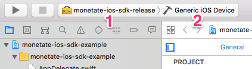
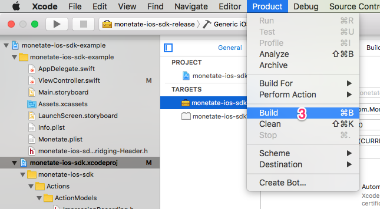
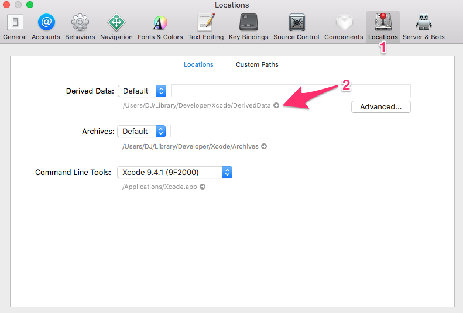
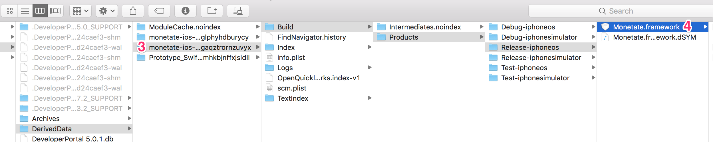

# Monetate iOS SDK

The Monetate iOS SDK is a wrapper around Monetate’s Engine API.  The SDK serves two primary purposes: data collection and action execution.

For data collection, the SDK functions very similarly to the monetateQ object used on the web to collect information and report it back to Monetate.  A client app can use the SDK to create a list of events and then send those events back to Monetate.  The client app can specify if the request is a Decision Request, and should return a list of executable actions, or if it’s just a data upload.

## Technologies

### Languages
Objective-C, Swift

### 3rd Party Libraries
None

## Developer Setup
To work on the SDK in a standalone setup, simply download the [project repository](https://github.com/monetate/monetate-ios-sdk) and open the project using Xcode.  For instructions on developing the SDK while it's embedded in an app, see the README for the [example app repo](https://github.com/monetate/monetate-ios-sdk-example).

### Jazzy
[Jazzy](https://github.com/realm/jazzy) is a tool used to generate fully styled pages of documentation from HeaderDoc formatted comments in the project's header files.  Jazzy can be installed via the following:
```
[sudo] gem install jazzy
```

### `sdk` Bash Script
The project contains a bash script named `sdk` at the project root.  This script offers the following features:
- easy generation of [Jazzy](https://github.com/realm/jazzy) documentation

The script can be executed via the following:
```
./sdk COMMAND
```

Running the script with no commands will output the list of commands that the script takes.

## Distribution

### Generating the Release `.framework` product

#### 1. Increment the build number
- In Xcode, select the `monetate-ios-sdk.xcodeproj` file in the file navigator pane to the left.
- In the project's settings, navigate to the _General_ tab at the top.
- Increment the value in the _version_ field to the new SDK version number.


#### 2. Build the framework for release
- In Xcode, select the _monetate-ios-sdk-release_ schema
- Select _Generic iOS Device_ as the target device
- Build the project using either the `cmd + b` shortcut, or the _Project > Build_ menu option.





#### 3. Locate the generated `.framework` product
- In the Xcode Preferences pane, select _Locations_
- Under the _Derived Data_ label, click the small gray arrow to the right of the _DerivedData_ folder path.  This will open a Finder window to the _DerivedData_ folder.
- If the SDK was built while attached to the _monetate-ios-sdk-example_ project, navigate to the _monetate-ios-sdk-example_ folder in the _DerivedData_ folder.  If the SDK was built as a standalone project, navigate to the _monetate-ios-sdk_ folder.
- From the relevant folder in the previous step, navigate to _Build > Products > Release-iphoneos_.  This folder should contain the _Monetate.framework_ folder.





### Uploading to the Monetate Website
n/a

### Uploading to Cocoapods
Cocoapods is an iOS package manager, similar to Pip for Python or Bundler for Ruby.  It allows an app to define a list of "pods", or libraries, that a given iOS or Mac OS project uses.  Cocoapods provides an easy way to install and use those libraries, and is generally the recommended way to install 3rd party libraries when developing for Mac or iOS.

At the time of this writing, the SDK is not yet publicly available via Cocoapods.  However, a `monetate-ios-sdk.podspec` file has been added to the repo to support a future Cocoapods distribution.  The podspec file is relatively complete, but the following fields should be reviewed before being publicly released:
- description
- license
- source

Cocoapods can be install via RubyGems, and the command `gem install cocoapods`.  Depending on your ruby installation, it may be necessary to run the installation command under `sudo`.  To release the SDK via Cocoapods, the framework needs to be added and pushed via the Cocoapod `trunk` commands.  More details on these commands can be found [here](https://guides.cocoapods.org/making/making-a-cocoapod.html).

### Uploading to Carthage
Carthage is an alternative package manager to Cocoapods.  While Cocoapods has been around longer, Carthage has been gaining popularity due to having a less intrusive library installation process than Cocoapods.

At the time of this writing, the SDK is not yet publically available via Carthage.  However, the SDK is currently set up to support Carthage when a release is desired.

#### Creating an archive
Due to the SDK being closed source, it's recommended to make it available using the binary format.  The SDK can be archived for Carthage by running the following command in the project root:
```
carthage build --archive
```
This generates a _Monetate.framework.zip_ file in the _Carthage > Build > iOS_ directory under the project root.  This file needs to be publicly hosted so that Carthage users can include it in their project's Cartfile via the `binary` option:
```
binary "https://www.monetate.com/path/to/SDK"
```

### Distribution Resources
The following resources should be helpful when completing the Cocoapods and Carthage distributions:
- [How to Create a Cocoapod in Swift](https://www.raywenderlich.com/5823-how-to-create-a-cocoapod-in-swift) -  While this tutorial uses Swift as the project language, it still provides a good overview of Cocopods and how to publish a pod.
- [Distributing Closed Source Frameworks with Cocoapods and Carthage](https://medium.com/@mkeremkeskin/distributing-closed-source-frameworks-with-cocoapods-and-carthage-44fd141cfd78) - A walkthrough on how to publish closed source frameworks using both Cocoapods and Carthage.


